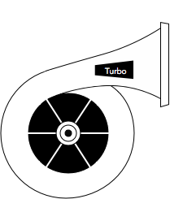

[](http://wecatch.me/turbo.html)

Turbo is a web framwork, based on tornado, developed for rapidly building web site and RESTFul api.

**Prerequisites**: Turbo now only runs on Python 2.x, Python 3 support will be added in future.

# Quickly start


```bash
pip install turbo
```

# License


Licensed under the Apache License, Version 2.0


